# Rufid

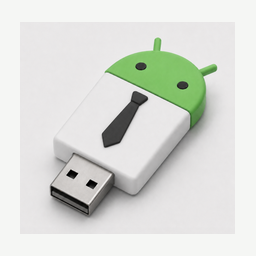

Rufid is a GPL Android USB image writer for phone-first boot media workflows. It is inspired by familiar desktop USB writer flows, but is not affiliated with Rufus, Ventoy, EtchDroid, or their authors.

The goal is not to clone every Rufus feature. The goal is a clean, auditable Android implementation of practical boot-media workflows, with stronger provenance, no ads, no analytics, no billing SDKs, and no opaque APK-extracted payloads.

## Screenshots

Captured from a Samsung Z Flip test device in dark mode.

| Main flow | URL mode | Official ISO picker |
| --- | --- | --- |
| 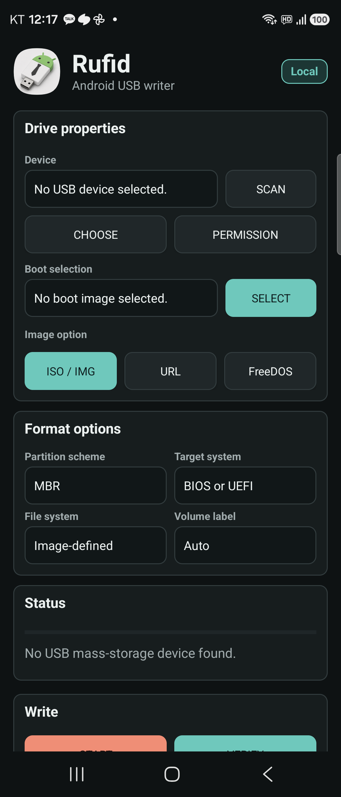 | 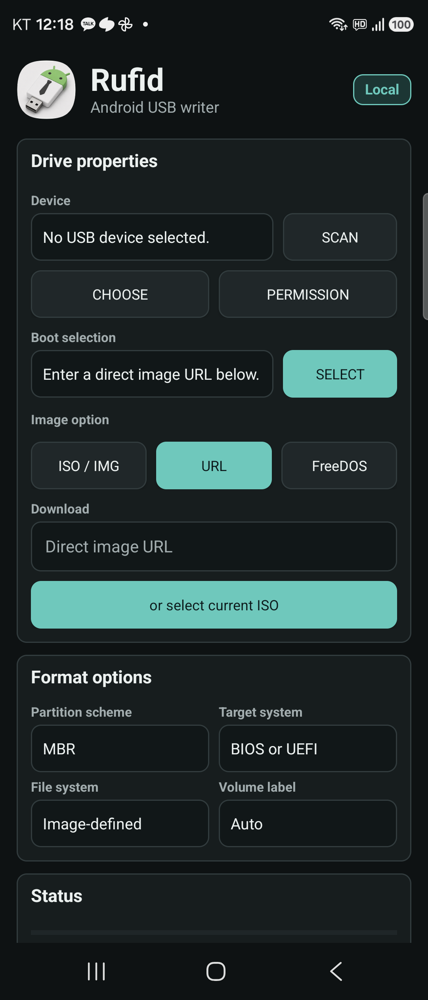 | 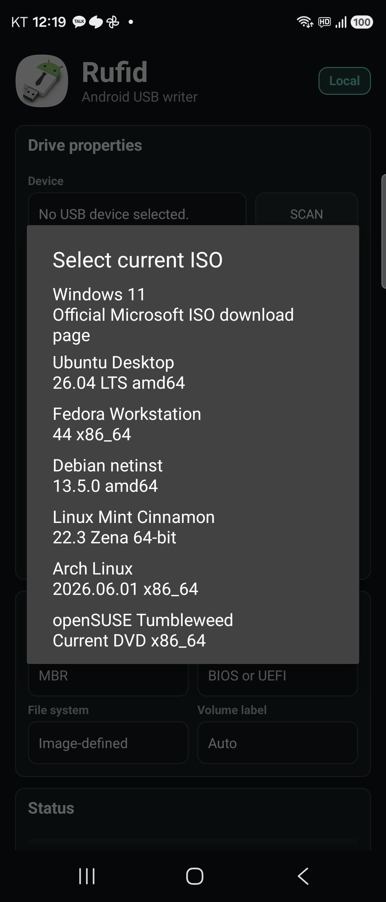 |

| FreeDOS | Write actions | Tools |
| --- | --- | --- |
| 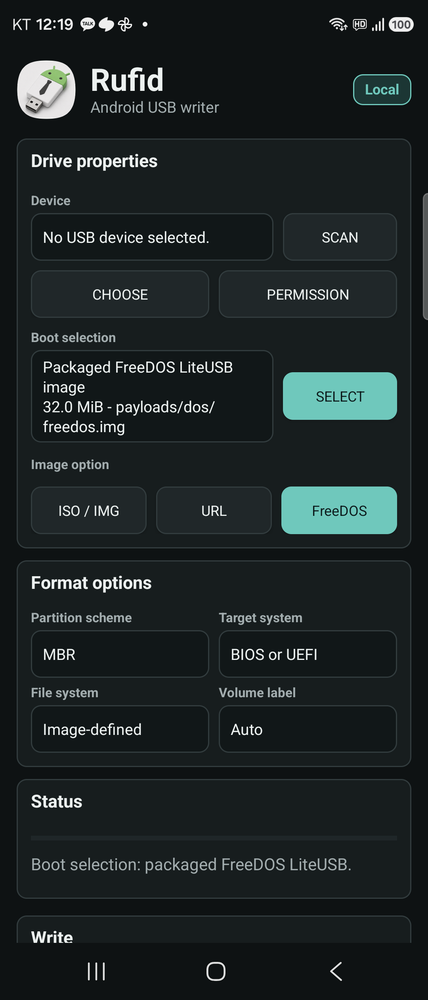 | 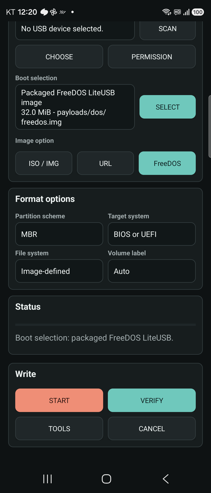 | 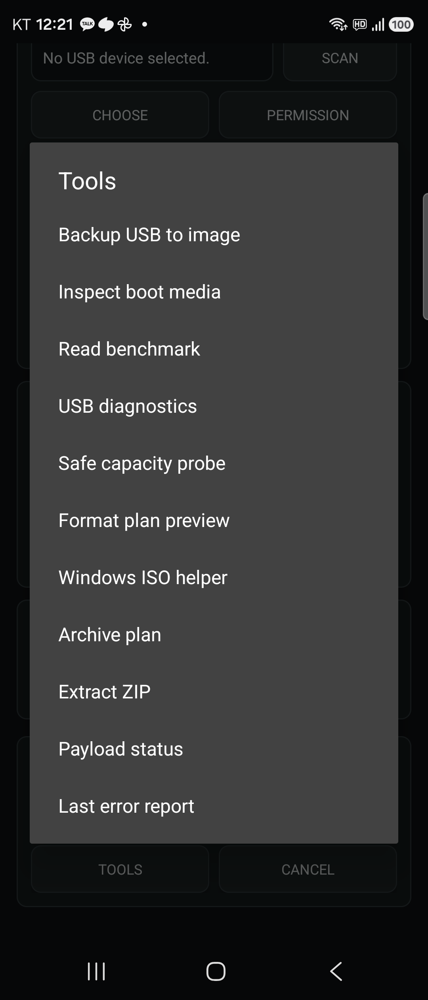 |

| Payload status |
| --- |
| 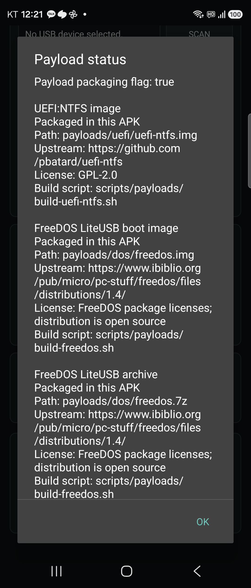 |

| exFAT recovery plan | exFAT recovery result | exFAT inspection |
| --- | --- | --- |
| 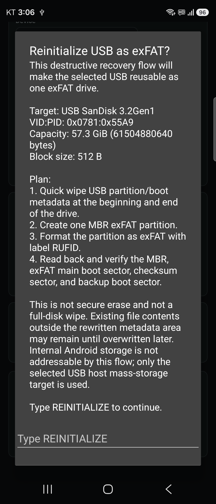 | 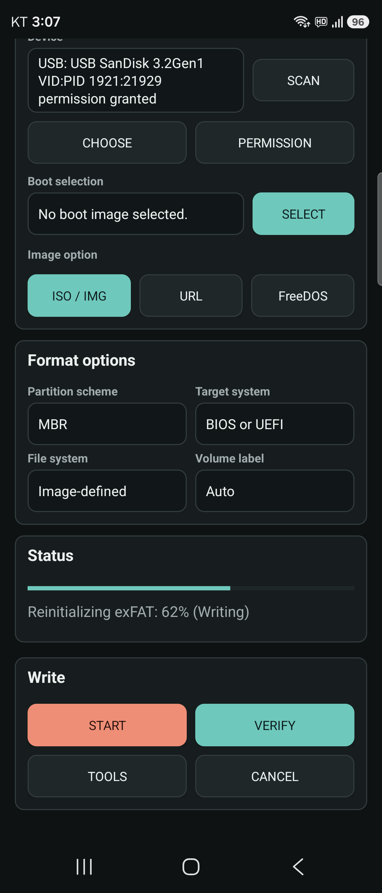 | 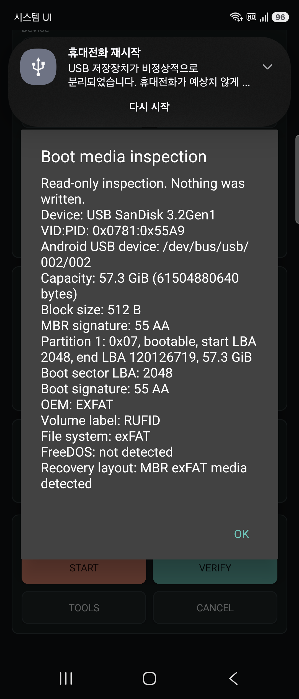 |

| Device-name label plan | Device-name label result | Device-name label inspection |
| --- | --- | --- |
| 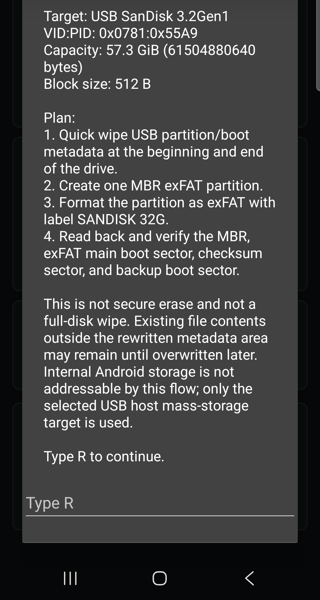 | 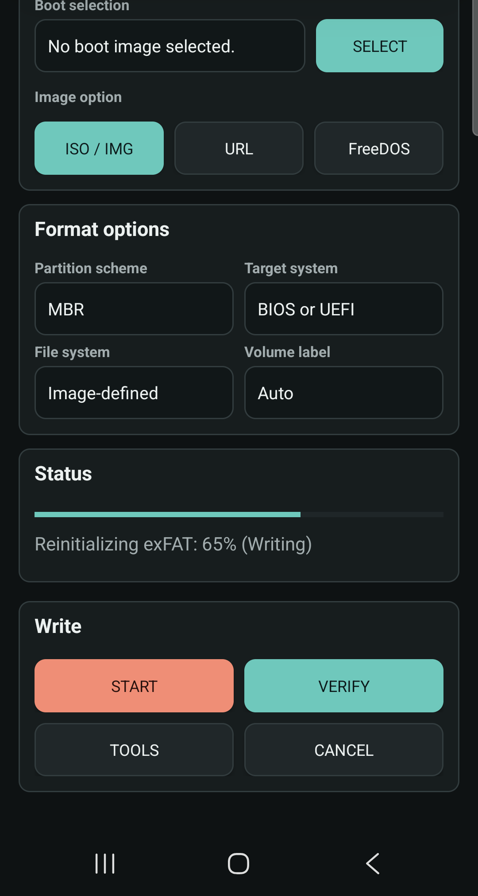 | 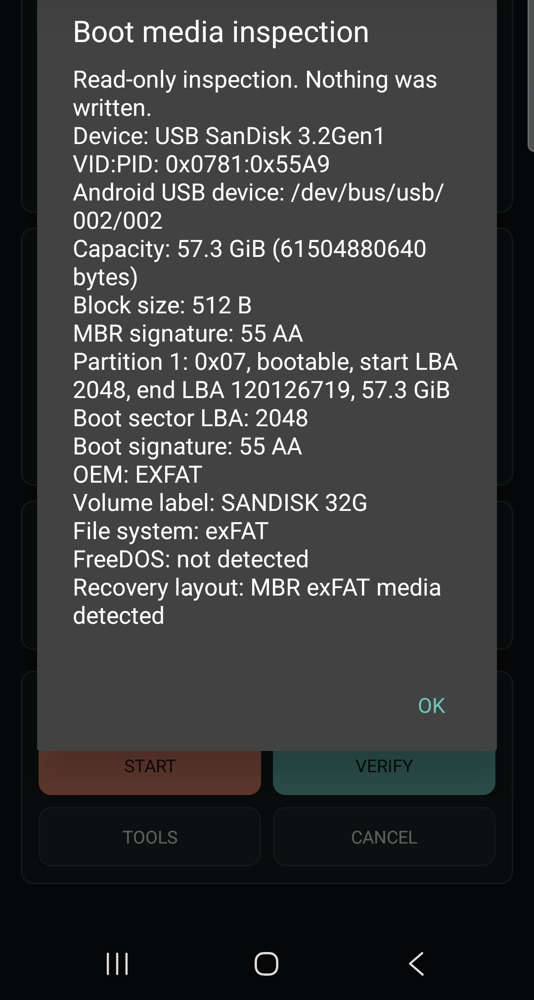 |

## Current Features

- Android USB host mass-storage scan, chooser, permission request, and diagnostics.
- Raw ISO/IMG writing to the selected USB target.
- Manual verification against the selected image.
- Packaged source-built FreeDOS write mode.
- Direct URL-to-USB streaming mode.
- `or select current ISO` picker with Windows, Ubuntu, Fedora, Debian, Linux Mint, Arch Linux, and openSUSE entries.
- Whole-device backup to an Android document.
- Read benchmark and read-only capacity probe.
- Read-only boot media inspection for MBR, FAT, and FreeDOS evidence.
- ZIP extraction to a selected Android folder.
- USB recovery/reinitialize flow: quick metadata wipe, one MBR FAT32 or exFAT partition, format, and post-write metadata verification.
- FAT32 and exFAT layout/formatter foundations and partition plan preview.
- Windows installer ISO extraction to a FAT32 UEFI layout, including source-built wimlib splitting for `install.wim` files larger than 4 GiB.
- ZIP and source-built 7-Zip-JBinding archive extraction to a selected Android folder.
- Windows installer ISO extraction to NTFS data volumes with MBR or GPT UEFI:NTFS helper layouts. The virtual boot gate reached Windows Setup under QEMU/OVMF, including enforced Secure Boot controls; physical-PC Secure Boot compatibility is not currently claimed.
- Local last-error report with no network crash upload.
- System light/dark mode UI.

## Safety Model

Rufid performs destructive USB writes only after a user-selected target and an explicit action. It does not request root. It uses Android's USB permission flow and writes through the selected USB mass-storage device.

USB recovery/reinitialize is a guarded destructive action. Rufid shows a plan screen with device name, size, VID/PID, quick-wipe scope, the selected FAT32 or exFAT format plan, the derived volume label, and verification steps, then requires typing `R`. This is not secure erase and not a full-disk wipe; it clears partition/boot metadata needed to make the selected USB usable again and formats a new volume.

The app deliberately avoids:

- ad SDKs
- analytics SDKs
- billing SDKs
- Firebase or external crash-reporting SDKs
- copied third-party app code or package names
- bundled payloads extracted from opaque APKs
- secure erase claims

## Payload Supply Chain

Release and F-Droid builds package the staged payload set by default.

Current staged payload set:

- FreeDOS FAT16 image and archive assembled from source-built FreeDOS kernel, FreeCOM, SYS, and boot sector artifacts. The official FreeDOS 1.4 LiteUSB archive is used only as the verified package/source input.
- UEFI:NTFS from pinned upstream source.
- wimlib Android native libraries and the Rufid WIM JNI bridge for `arm64-v8a`, `armeabi-v7a`, `x86`, and `x86_64`.
- 7-Zip-JBinding Android native libraries for `arm64-v8a`, `armeabi-v7a`, `x86`, and `x86_64`, with RAR/unRAR native sources excluded.

See [PAYLOAD_SUPPLY_CHAIN.md](PAYLOAD_SUPPLY_CHAIN.md), [payloads/README.md](payloads/README.md), and [THIRD_PARTY_NOTICES.md](THIRD_PARTY_NOTICES.md).

## Build From Source

The local build setup uses Android SDK/ADB and Gradle 8.9 under the surrounding workspace `work/tools` directory.

Full Android verification:

```powershell
gradle --no-daemon :app:assembleDebug :app:assembleRelease :app:testDebugUnitTest :app:lintDebug
```

F-Droid-style payload staging:

```bash
./scripts/fdroid/stage-source-payloads.sh
gradle --no-daemon :app:assembleRelease
```

Source-only developer smoke check:

```powershell
gradle --no-daemon --project-prop=rufid.includePayloads=false :app:assembleDebug
```

## Device Write Test

The current local audit installed and launched Rufid on a Samsung Z Flip `SM-F766N`, Android `16`/API `36`, through wireless ADB. Rufid detected a `USB SanDisk 3.2Gen1` drive with `57.3 GiB` capacity, wrote the packaged FreeDOS image to it, and the drive was then checked on a PC. The previous USB contents/partition information were replaced and the drive presented as FreeDOS media. Rufid's read-only inspection also detected FAT16/FreeDOS evidence: `FRDOS5.1`, volume label `FD14-LITE`, boot signature `55 AA`, and a bootable partition.

The same SanDisk drive was then recovered from FreeDOS media into one MBR exFAT volume from Rufid on the Z Flip. Rufid verified the MBR, exFAT main boot sector, checksum sector, and backup boot sector, then read-only inspection reported `OEM: EXFAT` and file system `exFAT`. Rufid 0.1.1 fixes recovery volume-label derivation so USB generation strings such as `3.2Gen1` are not misread as capacity text.

See [IMPLEMENTATION_STATUS.md](IMPLEMENTATION_STATUS.md) and [RUFID_AUDIT_REPORT.md](RUFID_AUDIT_REPORT.md).

## Documentation

- [Clean implementation scope](CLEAN_IMPLEMENTATION_SCOPE.md)
- [Implementation status](IMPLEMENTATION_STATUS.md)
- [Audit report](RUFID_AUDIT_REPORT.md)
- [Payload supply chain](PAYLOAD_SUPPLY_CHAIN.md)
- [F-Droid notes](FDROID.md)
- [F-Droid submission tracker](SUBMIT_TO_FDROID.md)
- [Asset provenance](ASSET_PROVENANCE.md)
- [Contributing](CONTRIBUTING.md)
- [Security policy](SECURITY.md)
- [Code of conduct](CODE_OF_CONDUCT.md)
- [Positioning notes](MARKETING.md)
- [Virtual Windows boot validation](docs/VIRTUAL_BOOT_VALIDATION.md)
- [Release notes v0.2.0](release-notes-v0.2.0.md)
- [Release notes v0.1.2](release-notes-v0.1.2.md)
- [Release notes v0.1.1](release-notes-v0.1.1.md)
- [Release notes v0.1.0](release-notes-v0.1.0.md)

## Project Info

- Package: `io.github.rufid`
- App name: `Rufid`
- Version: `0.2.0`
- Minimum Android SDK: 24
- Target Android SDK: 35
- License: `GPL-3.0-or-later`
